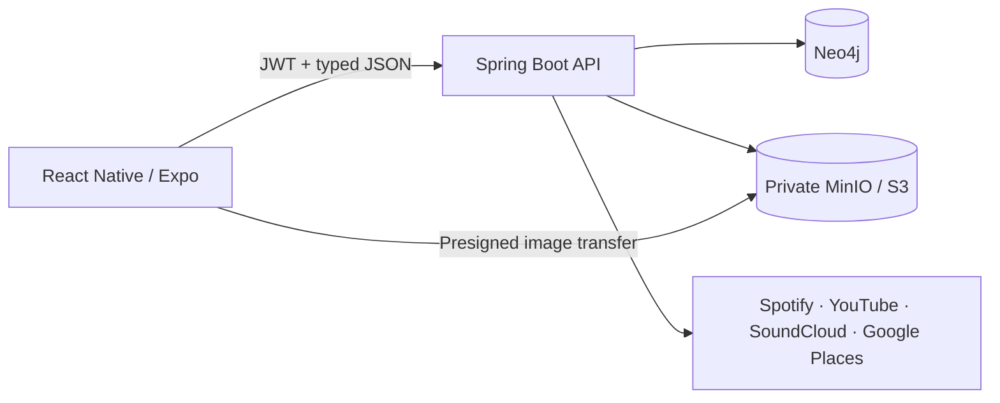

# MVPConnect

**The professional network for live music.**

MVPConnect connects Artists, Venues, and Promoters through structured profiles, media, relationships, and discovery—building the foundation for smarter opportunities across the live-music ecosystem.

[](https://github.com/AbslanLaverde/MVPConnect/actions/workflows/ci.yml)


*Promotional product artwork, not a runtime capture.*

**Artists • Venues • Promoters • One connected ecosystem**

## What is MVPConnect?

Live music still runs through scattered social profiles, spreadsheets, inboxes, and personal contacts. Artists need rooms and collaborators that fit. Venues need talent suited to their audience and production setup. Promoters need a clearer view of artists, venues, and markets.

MVPConnect turns that fragmented ecosystem into a structured network. Its completed Onboarding V1 captures each persona's identity, sound, space, media, relationships, and goals in a resumable flow, then promotes validated data into canonical profiles for the experiences that come next.

## Built for the Live-Music Network

### Artists

- Build a professional live-music identity.
- Present sound, live setup, media, and external artist presence.
- Find relevant venues and collaborators.
- Create the foundation for better-fit opportunities.

### Venues

- Define the room, audience, production support, and booking approach.
- Show artists and promoters what the space can support.
- Discover appropriate talent and build promoter relationships.
- Prepare for smarter open-date planning.

### Promoters

- Present specialties, markets, roster direction, and network.
- Connect artist and venue relationships in one model.
- Communicate the kinds of shows and opportunities they create.
- Build toward roster-aware booking workflows.

Future opportunity and matching capabilities are product direction, not claims of completed automation.

## Product Experience

Onboarding V1 is complete for all three personas, with backend-authoritative drafts, cross-platform controls, media, goals, and a dedicated graduation experience.

### Graduation


*Runtime capture of the final Welcome environment. Web and Android graduation behavior have been manually verified.*

### Persona onboarding


*Artist onboarding runtime capture. This supplied capture predates the final V1 copy and state polish; the implemented five-step flow is current.*


*Venue onboarding runtime capture. This supplied capture predates final V1 stabilization; the implemented six-step flow is current.*


*Promoter onboarding runtime capture. The image shows the older “Specialties” label; the current product uses “Your Lane.” Recapture is planned.*

Synthetic test accounts appear in these images. See [asset provenance](docs/PORTFOLIO.md#assets-and-screenshots) for exact dimensions and limitations.

## Current Status

| Area | Status |
| --- | --- |
| Artist Onboarding | ✅ Complete |
| Venue Onboarding | ✅ Complete |
| Promoter Onboarding | ✅ Complete |
| Web QA | ✅ Verified |
| Android QA | ✅ Verified |
| iOS QA | ◯ Not yet verified |
| Post-Onboarding Experience | 🚧 Next phase |

## Engineering Highlights

### Server-Authoritative Onboarding

Versioned, typed drafts remain resumable without becoming canonical profile data too early. Valid-only autosave, persistence-safe Sign Out, synchronized mutation responses, and backend-confirmed navigation prevent stale state and lost edits. Final promotion is validated and idempotent.

### Graph-Backed Domain Model

Simple intrinsic attributes remain persona properties. Independently meaningful resources and identities become nodes. Real associations become graph relationships. This keeps ordinary profile data readable while supporting external artists, venue identities, media, and future network reasoning.

### Production-Oriented Media Lifecycle

Private image bytes upload directly through presigned URLs while Neo4j owns canonical `MediaAsset` metadata. The client supports 3:1 Hero presentation, compact multi-select galleries, sequential uploads, partial-failure retention, and deterministic zero-based gallery order.

### Secure External Connections

Provider authorization stays backend-owned, with PKCE, state validation, one-time attempts, return-target allowlisting, and encrypted provider credentials. Spotify supplies external artist identity; YouTube and SoundCloud use OAuth; Instagram, Facebook, and Bandcamp use validated profile URLs where applicable.

### Cross-Platform Product Engineering

One React Native / Expo client serves web and native UI with shared responsive behavior. Onboarding V1 has completed human QA on web and Android, including native rendering fixes and generated native-safe brand assets. iOS has not yet been QA-verified.

## Architecture Snapshot



The API owns authentication, authorization, onboarding transitions, public/self projections, OAuth exchanges, and canonical promotion. Neo4j stores personas and relationships; private object storage holds image bytes. Instagram, Facebook, and Bandcamp are URL-first connections rather than OAuth integrations.

Read the [architecture guide](docs/ARCHITECTURE.md) for boundaries, tradeoffs, and implementation evidence.

## What's Next

The next major phase is the **post-onboarding experience**.

### Role-Specific Home

Give Artists, Venues, and Promoters useful landing experiences and route completed login and Welcome → ENTER to the correct role-specific Home.

### Profiles

Turn canonical onboarding data into polished public profiles, self profiles, and editing experiences.

### Artist Intelligence

Explore user-reviewable structured suggestions from existing signals such as “Sounds Like.” AI-derived data should remain transparent and correctable; this is not implemented yet.

### Discovery & Search

Help each side find the others through role, location, genres, and structured profile signals.

### Matching

Start with explainable deterministic matching across signals such as genre, geography, draw, venue capacity, goals, and network relationships before considering embeddings or machine learning.

Later milestones may include venue availability, promoter roster/network tools, opportunity generation, inquiries, connections, and messaging. These are directional milestones, not a delivery schedule.

## Tech Stack

- **Frontend:** React Native, Expo, TypeScript
- **Backend:** Spring Boot, Java 21
- **Data:** Neo4j, private MinIO/S3-compatible object storage
- **Integrations:** Spotify, YouTube, SoundCloud, Google Places
- **Testing:** Jest, Maven, Postman/Newman

## Local Development

1. Configure local environment files and process variables.
2. Start MinIO and a separate Neo4j instance.
3. Start the Spring Boot API with the `local` profile.
4. Install frontend dependencies and start Expo web or native.
5. Check health endpoints and exercise a disposable onboarding flow.

```powershell
# Backend, from the repository root
$env:SPRING_PROFILES_ACTIVE = 'local'
mvn -f mvpconnect-svc/pom.xml spring-boot:run

# Frontend, in a separate terminal
Set-Location mvpconnect-app
npm ci
npm run web -- --port 8081
```

See [Local Development](docs/LOCAL_DEVELOPMENT.md) for the complete setup, Neo4j/MinIO requirements, environment variables, native-device notes, and troubleshooting.

## Documentation

- [Architecture](docs/ARCHITECTURE.md) — system boundaries, graph model, onboarding, media, and integrations
- [Local Development](docs/LOCAL_DEVELOPMENT.md) — repeatable workstation setup and runtime checks
- [Environment](docs/ENVIRONMENT.md) — configuration and secret boundaries
- [Testing](docs/TESTING.md) — automated, API/E2E, and human-QA evidence
- [Portfolio Case Study](docs/PORTFOLIO.md) — engineering decisions and interview-ready narratives
- [Security Policy](SECURITY.md) — supported line and vulnerability-reporting guidance
- [Contributing](CONTRIBUTING.md) — branch, verification, and review expectations

MVPConnect is an evolving pre-release product. No public deployment, production-readiness certification, adoption metric, or completed booking/payment workflow is claimed by this repository. No open-source license has been granted.
