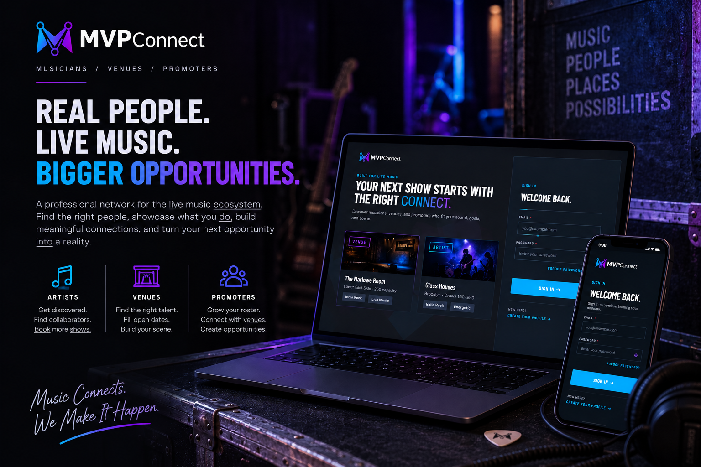
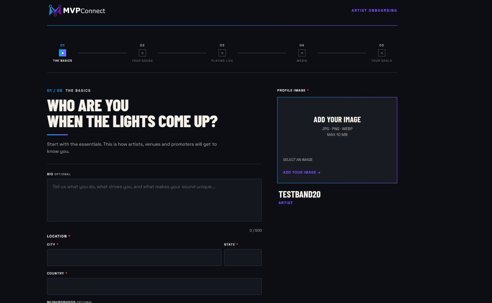
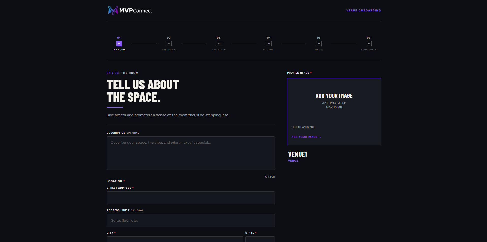
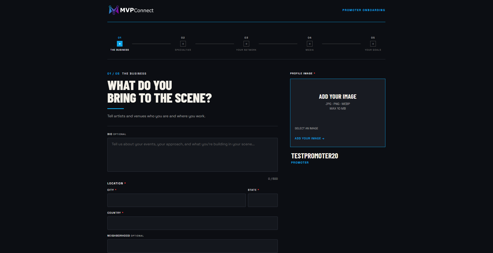
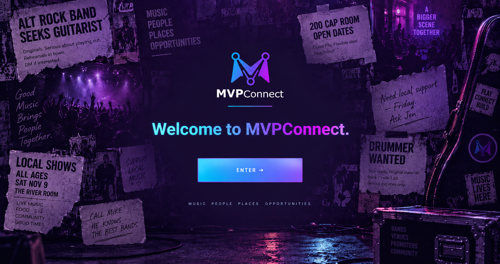

# MVPConnect

MVPConnect is a three-sided professional network for **Artists, Venues, and Promoters** in the live/local music ecosystem. It brings fragmented identity, discovery, and relationship information into a structured network designed to support collaboration and booking opportunities.



*Promotional composite presenting the product across desktop and mobile, not a literal runtime screenshot. The capability descriptions below distinguish implemented workflows from product direction.*

Artists need relevant rooms and collaborators; venues need artists suited to their space; promoters connect talent with places and opportunities. The product thesis is that structured profiles, external identities, and meaningful relationships can improve discovery across that network.

The current implementation provides account creation, resumable persona-specific onboarding, profile media, external identities, and basic Artist-to-Venue matching. It is an evolving MVP, not yet a complete booking marketplace. The client uses **Artist** terminology; backend persona values, routes, and legacy screens retain `MUSICIAN` / `Musician` names.

## What is implemented

| Area | Repository-backed capability | Boundary |
| --- | --- | --- |
| Accounts | Artist, Venue, and Promoter signup; JWT login; authenticated self-account reads | Password reset remains a UI placeholder |
| Onboarding | Typed steps, server validation, saved drafts, resume, completion, and sign-out handling | Backend-confirmed state controls navigation; the placeholder save bypass is disabled |
| Goals | Required persona-specific selections, saved canonically and returned to the owner | Private intent signals; goals-driven ranking and dedicated post-onboarding editing remain deferred |
| Media | Private JPEG, PNG, and WebP uploads, profile/banner/gallery references, expiring access URLs | Image storage, not general video hosting |
| External context | Spotify artist identities; Google Places locations and venue identities; free-form references | Provider lookup needs backend credentials; a referenced entity is not necessarily a registered account |
| External connections | Persona-specific URL connections; YouTube/SoundCloud OAuth for Artists | Provider configuration is required; this is not social login |
| Discovery | Public profile APIs, Artist/Venue search, legacy Artist home and profile editing, venue matches | Matching counts shared genres among live-music venues; no learned recommendation model |

The welcome screen currently sends every persona to `MusicianHome`, which calls musician APIs. Dedicated venue/promoter dashboards are not implemented. Messaging, payments, booking transactions, push notifications, and token refresh are not presented as shipped capabilities.

## Three-persona onboarding

Shared onboarding infrastructure supports distinct identities, data, and workflows. These supplied desktop screenshots show the first step for each persona, followed by the Welcome experience. They include synthetic/test accounts; capture revisions are unknown, and some labels or styling differ from this checkout. See [image provenance](docs/PORTFOLIO.md#assets-and-screenshots).

### Artist

The Basics introduces the Artist's profile identity, image, and location within an Artist-specific progression.



### Venue

The Room collects the space's identity, description, and address, with a progression tailored to music, production, and booking needs.



### Promoter

The Business introduces the Promoter's identity and place in the scene, leading into specialties and network information.



### Completion and Welcome

The backend revalidates persisted onboarding data, promotes canonical profile/network state, and records completion before Welcome becomes eligible. This graduation moment is separate from the onboarding forms; the current ENTER destination remains the legacy `MusicianHome` described above.



## Engineering highlights

- **Draft-to-profile lifecycle:** versioned onboarding contracts separate incomplete answers from canonical profile data, with ownership checks and completion validation on the server.
- **Purposeful graph modeling:** intrinsic attributes stay on persona nodes; independent identities/resources become nodes; meaningful associations become relationships. External artists and venue identities can be referenced without creating login accounts.
- **Private media delivery:** metadata lives in Neo4j while image bytes move directly to S3-compatible storage through presigned URLs.
- **Explicit public projections:** goals, venue booking email, and provider credentials stay outside public profile/discovery projections.
- **Operational visibility:** request logging and distinct liveness/readiness probes make dependency failures easier to diagnose.

See [architecture](docs/ARCHITECTURE.md) for implementation evidence and tradeoffs, and [the portfolio case study](docs/PORTFOLIO.md) for a reusable presentation and maintenance checklist.

## Product direction

Planned work includes richer persona-specific home/profile experiences, broader discovery, and goals-aware matching. Longer-term direction includes messaging, venue availability, roster/network workflows, and opportunities connecting a promoter's artist with a suitable venue open date. Provider connections and graph references are foundations for that work, not evidence of an AI classification or recommendation pipeline.

The MVP prioritizes identity, introductions, and discovery before payments, contracts, or complete booking transactions. See [portfolio direction and tradeoffs](docs/PORTFOLIO.md).

## Run locally

The application uses an Expo / React Native client, a Spring Boot API, and Neo4j, with S3-compatible media storage.

Use the [local setup guide](docs/LOCAL_DEVELOPMENT.md) for prerequisites, Neo4j configuration, MinIO startup, and separate backend/frontend terminals. Compose starts MinIO only; it does not start Neo4j or the application.

Once infrastructure and environment variables are configured:

```powershell
# Repository root, backend terminal
$env:SPRING_PROFILES_ACTIVE = 'local'
mvn -f mvpconnect-svc/pom.xml spring-boot:run
```

```powershell
# Separate terminal
Set-Location mvpconnect-app
npm ci
npm run web -- --port 8081
```

The API defaults to `http://localhost:8080`, with no `/api` prefix. The frontend URL is configured through `EXPO_PUBLIC_API_BASE_URL`, not by editing source files. See [environment and secrets](docs/ENVIRONMENT.md) before enabling external providers.

## Repository map

| Path | Purpose |
| --- | --- |
| [mvpconnect-app](mvpconnect-app/README.md) | Expo SDK 51, React 18, React Native 0.74, TypeScript, React Navigation, Redux Toolkit / RTK Query, Axios |
| [mvpconnect-svc](mvpconnect-svc/pom.xml) | Java 21, Spring Boot 3.5.16, Spring Security, Spring Data Neo4j, AWS SDK v2 |
| [mvpconnect-mcp](mvpconnect-mcp/README.md) | Optional Python/FastMCP prototype with direct database access; separate from the app runtime |
| [compose.yaml](compose.yaml) | Local MinIO and private bucket initialization |
| [postman](postman) / [scripts](scripts) | Backend E2E collection, generator, and guarded local cleanup |
| [docs](docs) | Setup, configuration, architecture, validation, and portfolio maintenance |

## Validation and further reading

```powershell
# Repository root
mvn -f mvpconnect-svc/pom.xml test
node --test scripts/cleanup-local-e2e.test.js
```

```powershell
# mvpconnect-app
npm test
npm run typecheck
```

[Testing guide](docs/TESTING.md) · [Backend E2E runbook](BACKEND_E2E_TESTING.md) · [Media storage](mvpconnect-svc/MEDIA_STORAGE.md) · [External connections](mvpconnect-svc/MEDIA_CONNECTIONS.md) · [Spotify identities](mvpconnect-svc/SPOTIFY_EXTERNAL_ARTISTS.md) · [Venue identities](mvpconnect-svc/VENUE_IDENTITY.md) · [Logging](mvpconnect-svc/LOGGING.md)

Feature statements describe code present in this repository, not a production deployment or external-provider certification. No root license file or public deployment URL is supplied by this checkout.
