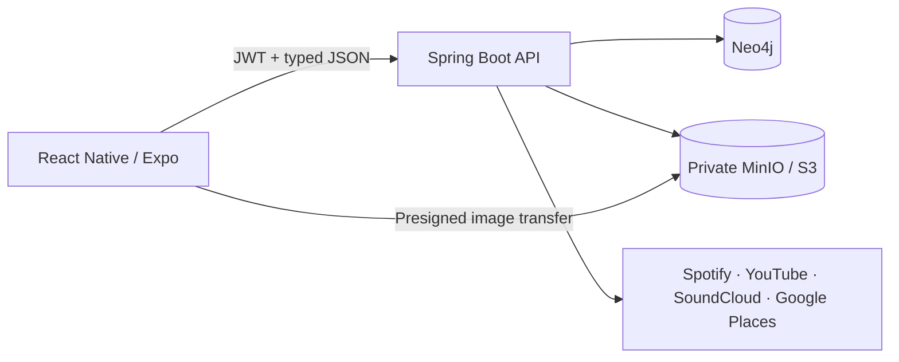

# MVPConnect

**The professional network for live music.**

MVPConnect brings Artists, Venues, and Promoters into a structured live-music network through persona-specific onboarding, canonical profile data, and dedicated Home experiences.

*Promotional product artwork, not a runtime capture.*

**Artists • Venues • Promoters • One connected ecosystem**

## What is MVPConnect?

Live music still runs through scattered social profiles, spreadsheets, inboxes, and personal contacts. Artists need rooms and collaborators that fit. Venues need talent suited to their audience and production setup. Promoters need a clearer view of artists, venues, and markets.

MVPConnect turns that fragmented ecosystem into a structured network. Onboarding V1 captures each persona's identity, sound, space, media, relationships, and goals in a resumable flow, promotes validated data into canonical profiles, and graduates each completed account into a dedicated persona-specific Home.

## Built for the Live-Music Network

### Artists

- Build a professional live-music identity.
- Present sound, live setup, media, and external artist presence.
- Record performance history and artist references.
- Capture connection goals alongside musical identity.

### Venues

- Define the room, audience, production support, and booking approach.
- Capture the space's equipment and technical capabilities.
- Record artist references and booking preferences.
- Capture connection goals alongside the room's identity.

### Promoters

- Present specialties, markets, roster direction, and network.
- Connect artist and venue relationships in one model.
- Describe the kinds of events they organize.
- Capture connection goals alongside business identity.

## Product Experience

Onboarding V1 and the first post-onboarding Home foundation are complete for all three personas. The first-run experience includes backend-authoritative drafts, cross-platform controls, media, goals, a dedicated graduation experience, and role-aware entry into Artist Home, Venue Home, or Promoter Home.

### Graduation

*Runtime capture of the final Welcome environment. Web and Android graduation behavior are QA-verified.*

### Persona onboarding

*Artist onboarding runtime capture. This supplied capture predates the final V1 copy and state polish; the implemented five-step flow is current.*

*Venue onboarding runtime capture. This supplied capture predates final V1 stabilization; the implemented six-step flow is current.*

*Promoter onboarding runtime capture. The image shows the older “Specialties” label; the current product uses “Your Lane.” Recapture is planned.*

Synthetic test accounts appear in these images. See [asset provenance](docs/PORTFOLIO.md#assets-and-screenshots) for exact dimensions and limitations.

## Current Status

| Area | Status |
| --- | --- |
| Artist Onboarding | ✅ Complete |
| Venue Onboarding | ✅ Complete |
| Promoter Onboarding | ✅ Complete |
| Artist Home V1 | ✅ Complete |
| Venue Home V1 | ✅ Complete |
| Promoter Home V1 | ✅ Complete |
| Web QA | ✅ Verified |
| Android QA | ✅ Verified |
| iOS QA | ◯ Structurally supported; not yet QA-certified |

### Home foundations

MVPConnect keeps three product responsibilities distinct:

- **Profile:** Who is this?
- **Home:** What is happening and worth acting on?
- **Discovery:** Who or what can I find?

Home V1 establishes a responsive, persona-aware destination with authenticated identity, a Needs Your Attention foundation, and truthful loading, error, and empty states.

## Engineering Highlights

### Server-Authoritative Onboarding

Versioned, typed drafts remain resumable without becoming canonical profile data too early. Valid-only autosave, persistence-safe Sign Out, synchronized mutation responses, and backend-confirmed navigation prevent stale state and lost edits. Final promotion is validated and idempotent.

### Graph-Backed Domain Model

Simple intrinsic attributes remain persona properties. Independently meaningful resources and identities become nodes. Real associations become graph relationships. This keeps ordinary profile data readable while supporting external artists, venue identities, media, and future network reasoning.

### Production-Oriented Media Lifecycle

Private image bytes upload directly through presigned URLs while Neo4j owns canonical `MediaAsset` metadata. The client supports 3:1 Hero presentation, compact multi-select galleries, sequential uploads, partial-failure retention, and deterministic zero-based gallery order.

### Secure External Connections

Provider authorization stays backend-owned, with PKCE, state validation, one-time attempts, return-target allowlisting, and encrypted provider credentials. Spotify supplies external artist identity; YouTube and SoundCloud use OAuth; Instagram, Facebook, and Bandcamp use validated profile URLs where applicable.

### Cross-Platform Product Engineering

One React Native / Expo client serves web and native UI with shared responsive behavior. Onboarding V1 and Home V1 are QA-verified on Web and Android. iOS remains structurally supported but is not yet QA-certified.

### Persona-Specific Home Architecture

A shared responsive Home foundation supports separate Artist, Venue, and Promoter compositions, role-aware authenticated routing, and reusable loading, error, and empty-state conventions. See the [Home engineering story](docs/PORTFOLIO.md#engineering-story-4-persona-specific-home-architecture) for the design and migration decisions.

## Architecture Snapshot

The API owns authentication, authorization, onboarding transitions, public/self projections, OAuth exchanges, and canonical promotion. Neo4j stores personas and relationships; private object storage holds image bytes. Instagram, Facebook, and Bandcamp are URL-first connections rather than OAuth integrations.

Read the [architecture guide](docs/ARCHITECTURE.md) for boundaries, tradeoffs, and implementation evidence.

## What's Next

The next major phase is **Profile + Profile Editing**, beginning with Artist and then extending to Venue and Promoter.

### Profiles and Editing

Turn canonical onboarding data into polished public profiles, self profiles, and editing experiences.

### Discovery & Search

Help each side find the others through role, location, genres, and structured profile signals.

### Matching

Build explainable Connect recommendations from structured signals before considering opaque ranking approaches.

Later milestones may add actionable Home modules, structured Board opportunities, messaging and relationship workflows, venue availability, and promoter roster/network tools. These are future directions, not claims of implemented functionality or a delivery schedule.

## Tech Stack

- **Frontend:** React Native, Expo, TypeScript
- **Backend:** Spring Boot, Java 21
- **Data:** Neo4j, private MinIO/S3-compatible object storage
- **Integrations:** Spotify, YouTube, SoundCloud, Google Places
- **Testing:** Jest, Maven, Postman/Newman

## Documentation

- [Architecture](docs/ARCHITECTURE.md) — system boundaries, graph model, onboarding, media, and integrations
- [Environment](docs/ENVIRONMENT.md) — configuration and secret boundaries
- [Testing](docs/TESTING.md) — automated, API/E2E, and human-QA evidence
- [Portfolio Case Study](docs/PORTFOLIO.md) — engineering decisions and interview-ready narratives
- [Security Policy](SECURITY.md) — supported line and vulnerability-reporting guidance
- [Contributing](CONTRIBUTING.md) — branch, verification, and review expectations

MVPConnect is an evolving pre-release product. No public deployment, production-readiness certification, adoption metric, or completed booking/payment workflow is claimed by this repository. No open-source license has been granted.
