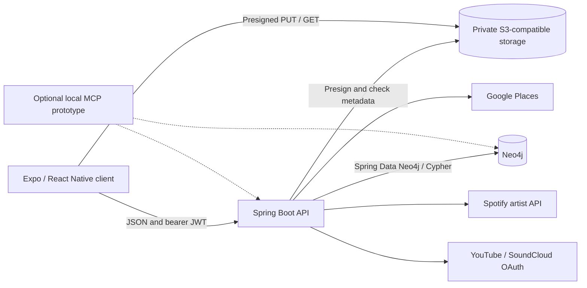

# Architecture

This describes implementation at `439eb614eee48fb7c813719f9410820059d11cb8`. Source code takes precedence over older design notes.

## Runtime boundaries

Compose provides MinIO locally. Neo4j and both application processes run separately. S3 configuration is supported, but no production deployment is established by this diagram. The optional Python MCP prototype has direct graph access outside the API authorization boundary.

## Client and API

[AppNavigator](../mvpconnect-app/src/navigation/AppNavigator.tsx) owns signup, login, onboarding, OAuth-result, welcome, musician-home, and profile routes. [api.ts](../mvpconnect-app/src/services/api.ts) supplies Axios requests and bearer tokens from AsyncStorage; [onboardingApi](../mvpconnect-app/src/onboarding/onboardingApi.ts) uses RTK Query for onboarding/self-account state. A 401 removes stored authentication data. There is no token-refresh flow in this client.

[SecurityConfig](../mvpconnect-svc/src/main/java/com/mint/security/SecurityConfig.java) configures stateless JWT authentication, BCrypt, CORS, and public routes. GET reads under `/musicians/**`, `/venues/**`, and `/promoters/**` are public; other operations generally require authentication, with explicit exceptions for auth, OAuth callbacks, health, and errors. A public DTO is a selected data shape, not anonymous access to every API operation.

[PersonaAuthorizationService](../mvpconnect-svc/src/main/java/com/mint/security/PersonaAuthorizationService.java) constrains owner operations. [PublicProfileService](../mvpconnect-svc/src/main/java/com/mint/services/PublicProfileService.java), [DiscoveryProfileMapper](../mvpconnect-svc/src/main/java/com/mint/services/DiscoveryProfileMapper.java), and [SelfAccountService](../mvpconnect-svc/src/main/java/com/mint/services/SelfAccountService.java) separate public responses from owner data. Do not substitute direct graph-entity serialization for those projections.

## Onboarding and graph data

The intentional modeling rule is: **intrinsic attributes remain persona properties; independently meaningful identities/resources become nodes; real associations become relationships**. Genres, vibes, and goals do not require their own nodes merely for normalization. Media and external identities have independent lifecycles. This supports the future network while keeping ordinary profile attributes straightforward.

Verified examples in [ExternalArtistRepository](../mvpconnect-svc/src/main/java/com/mint/repositories/ExternalArtistRepository.java) include `SOUNDS_LIKE`, `HAS_WORKED_WITH`, `HAS_ON_ROSTER`, and `HAS_ARTIST_IDENTITY`; [VenueIdentityRepository](../mvpconnect-svc/src/main/java/com/mint/repositories/VenueIdentityRepository.java) includes `WORKS_WITH`. Those stored associations do not imply operational roster dashboards or completed booking workflows.

[OnboardingStepRegistry](../mvpconnect-svc/src/main/java/com/mint/onboarding/OnboardingStepRegistry.java) defines schema version 2, persona-specific step order, and request types. [OnboardingService](../mvpconnect-svc/src/main/java/com/mint/services/OnboardingService.java) coordinates drafts, validation, transitions, and completion. [OnboardingStepContractService](../mvpconnect-svc/src/main/java/com/mint/services/OnboardingStepContractService.java) validates typed payloads and applies them to canonical profiles.

Account nodes (`Musician`, `Venue`, `Promoter`) link through `HAS_ONBOARDING_DRAFT` to `OnboardingDraft`, then `HAS_STEP` to `OnboardingStep`; steps can link media through `HAS_MEDIA`. Other identity/reference relationships use repository Cypher. The graph also includes `ExternalArtist`, `VenueIdentity`, `MediaAsset`, `ExternalConnection`, and `OAuthConnectionAttempt` nodes. Referenced artists and venue identities need not be registered accounts.

[ExternalArtistRelationshipService](../mvpconnect-svc/src/main/java/com/mint/services/ExternalArtistRelationshipService.java) and [VenueIdentityRelationshipService](../mvpconnect-svc/src/main/java/com/mint/services/VenueIdentityRelationshipService.java) synchronize profile references on onboarding completion. [Neo4jSchemaInitializer](../mvpconnect-svc/src/main/java/com/mint/config/Neo4jSchemaInitializer.java) creates declared uniqueness constraints and text indexes at startup; it is not a complete historical migration framework.

[onboardingConfig](../mvpconnect-app/src/onboarding/onboardingConfig.ts) maps client presentation to backend personas (`artist` maps to `MUSICIAN`) and sets `ONBOARDING_PLACEHOLDER_SAVE_BYPASS = false`. Backend-confirmed state controls navigation. Saved draft answers are not equivalent to a completed profile.

The final goals flow saves `/onboarding/steps/goals`, completes that step, then calls `POST /onboarding/complete`. The service revalidates persisted steps/references, promotes canonical data and media membership, and records completion/version metadata. A repeated completion for the current version returns existing completion metadata. Welcome is a separate graduation screen, not another form or a second canonical-promotion operation.

Goals describe future intent, not current professional status. The typed [goal requests](../mvpconnect-svc/src/main/java/com/mint/dto/onboarding) require nonempty persona-specific selections. Canonical `connectionGoals` appear in authenticated account DTOs but not public profile DTOs; venue `bookingEmail` follows the same self/public boundary. Goal collection does not drive the current genre matcher. Post-onboarding goal editing and goals-based ranking remain deferred.

## Media and provider connections

[MediaService](../mvpconnect-svc/src/main/java/com/mint/services/MediaService.java) creates an owned pending media record and presigned upload URL. The client PUTs bytes directly to storage, then calls completion. The backend checks stored content length and MIME metadata before marking the asset ready. Onboarding attaches media to draft steps; public media is projected through [PublicProfileMediaService](../mvpconnect-svc/src/main/java/com/mint/services/PublicProfileMediaService.java).

JPEG, PNG, and WebP are allowed, with a default 10MB limit and 15-minute upload/access URLs. Metadata verification is not malware scanning or full image-content inspection. Graph transactions and object-store operations cross systems; cleanup/failure handling does not create a distributed transaction. See [media storage](../mvpconnect-svc/MEDIA_STORAGE.md).

[MediaAssetRepository](../mvpconnect-svc/src/main/java/com/mint/repositories/MediaAssetRepository.java) represents canonical profile/banner/gallery membership with `HAS_MEDIA` and gallery ordering with relationship `sortOrder`. Replacing membership removes edges, not necessarily the underlying asset or object. Provider avatar metadata is separate from uploaded media; presenting a provider image does not make it a MinIO upload.

Spotify uses backend Client Credentials for artist lookup. Google Places enriches locations and venue identities. YouTube/SoundCloud use backend-owned OAuth attempts; [TokenEncryptionService](../mvpconnect-svc/src/main/java/com/mint/security/TokenEncryptionService.java) encrypts stored provider credentials with AES-GCM. Connections do not replace MVPConnect login. See [environment configuration](ENVIRONMENT.md) for credentials, encryption keys, and return allowlists.

[OAuthConnectionService](../mvpconnect-svc/src/main/java/com/mint/services/OAuthConnectionService.java) owns state validation, one-time attempt consumption, and token exchange. Both provider clients send S256 PKCE challenges. Return allowlisting and replay/error behavior have focused service tests. The supplied product brief reports earlier live YouTube/SoundCloud verification; this documentation branch did not repeat it. See [testing provenance](TESTING.md).

## Discovery and limits

[MusicianController](../mvpconnect-svc/src/main/java/com/mint/controllers/MusicianController.java) implements `/musicians/{id}/matches` by loading venues, selecting live-music venues with shared genres, and sorting by overlap count. Responses include text such as `2/3 genres matched`. This is a heuristic with an all-venues scan, not graph-traversal ranking or machine learning. Search uses repository queries and controller filtering; no scalability benchmark is supplied.

[WelcomeScreen](../mvpconnect-app/src/screens/WelcomeScreen.tsx) routes all completed personas to `MusicianHome`; [MusicianHomeScreen](../mvpconnect-app/src/screens/MusicianHomeScreen.tsx) calls musician endpoints. Venue/promoter dashboard completeness cannot be inferred from signup/onboarding support. Password reset remains an alert in [LoginScreen](../mvpconnect-app/src/screens/LoginScreen.tsx).

## API orientation and observability

| Area | Routes to start with | Contract source |
| --- | --- | --- |
| Accounts | `POST /auth/login`, `POST /auth/signup/{musician,venue,promoter}`, `GET /me` | Auth/self-account controllers and DTOs |
| Onboarding | `GET /onboarding`, `PUT /onboarding/steps/{stepKey}`, step complete/skip/reopen, `POST /onboarding/complete` | Onboarding controllers and registry |
| Media | `POST /media/uploads`, `POST /media/{mediaId}/complete`, owned read/delete | MediaController / MediaService |
| Identity | `/external-artists`, `/venue-identities`, `/me/artist-identity`, `/locations` | Corresponding controllers |
| Provider connections | `/external-connections`, `/external-connections/oauth` | ExternalConnectionController / ExternalOAuthController |
| Public reads | `/musicians/{id}`, `/musicians/search`, `/musicians/{id}/matches`, `/venues/{id}`, `/venues/search`, `/promoters/{id}` | Public profile/discovery controllers and DTOs |

This table is an orientation, not a generated OpenAPI contract. [The Postman generator](../postman/build-collection.js) and [E2E guide](../BACKEND_E2E_TESTING.md) provide executable examples for covered workflows. Check request DTOs before extending a client.

Request logging includes correlation/account/persona context and configurable slow-operation logging. Actuator liveness checks process state; readiness includes Neo4j and object storage without raw dependency exception details. See [logging](../mvpconnect-svc/LOGGING.md) and [tests](TESTING.md). Tests do not establish production readiness, provider certification, or native-device compatibility.
