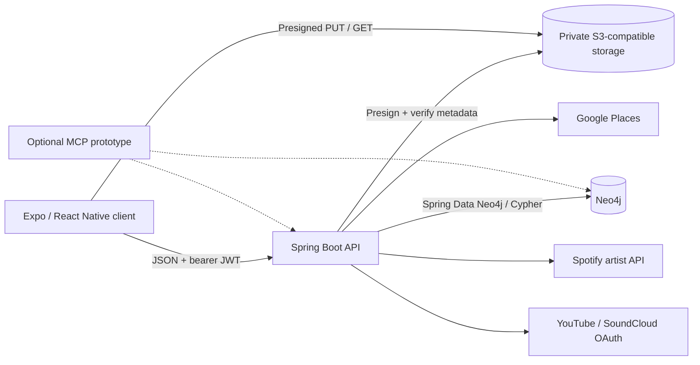

# Architecture

Source code takes precedence over this guide.

## Runtime boundaries

The React Native / Expo client shares web and native product code. The Spring Boot API owns authentication, authorization, typed onboarding transitions, external-provider exchanges, and public/self projections. Neo4j stores personas, resources, and relationships. Private MinIO/S3-compatible storage holds image bytes; the client transfers them through short-lived presigned URLs.

The optional Python MCP prototype can read the graph directly and therefore sits outside the API's normal authorization and DTO boundaries.

## Client, authentication, and navigation

[AppNavigator](../mvpconnect-app/src/navigation/AppNavigator.tsx) owns signup, login, onboarding, OAuth result, Welcome, persona-specific Home, and profile routes. [api.ts](../mvpconnect-app/src/services/api.ts) attaches the stored bearer token and clears persisted authentication after a qualifying 401; there is no token-refresh flow.

[SecurityConfig](../mvpconnect-svc/src/main/java/com/mint/security/SecurityConfig.java) configures stateless JWT authentication, BCrypt, CORS, and public routes. [PersonaAuthorizationService](../mvpconnect-svc/src/main/java/com/mint/security/PersonaAuthorizationService.java) enforces owner operations. Public and owner responses are intentionally mapped through [PublicProfileService](../mvpconnect-svc/src/main/java/com/mint/services/PublicProfileService.java), [DiscoveryProfileMapper](../mvpconnect-svc/src/main/java/com/mint/services/DiscoveryProfileMapper.java), and [SelfAccountService](../mvpconnect-svc/src/main/java/com/mint/services/SelfAccountService.java) rather than direct entity serialization.

Completed users enter a persona-specific Home through one shared resolver: Musicians route to `ArtistHome`, Venues to `VenueHome`, and Promoters to `PromoterHome`. Completed login goes directly Home, while first-time onboarding completion reaches Welcome before ENTER resolves the same destination.

## Post-onboarding Home architecture

Home answers “What is happening and worth acting on?” It is intentionally separate from Profile (“Who is this?”) and Discovery (“Who or what can I find?”).

The shared Home foundation provides infrastructure rather than a configurable dashboard engine:

- [HomeShell](../mvpconnect-app/src/home/shared/HomeShell.tsx) owns responsive framing, scrolling, and safe-area behavior.
- [HomeHeader](../mvpconnect-app/src/home/shared/HomeHeader.tsx) owns authenticated identity presentation, time-aware greeting, image/fallback behavior, and persona accents.
- [HomeSection](../mvpconnect-app/src/home/shared/HomeSection.tsx) and [HomeEmptyState](../mvpconnect-app/src/home/shared/HomeEmptyState.tsx) provide consistent section and truthful empty-state structure.
- [AttentionSection](../mvpconnect-app/src/home/shared/AttentionSection.tsx) composes the current `NEEDS YOUR ATTENTION` foundation.
- [HomeIdentityError](../mvpconnect-app/src/home/shared/HomeIdentityError.tsx) keeps the frame intact and provides inline retry behavior when `/me` fails.

Product behavior remains explicit in three compositions:

- [ArtistHomeScreen](../mvpconnect-app/src/home/artist/ArtistHomeScreen.tsx)
- [VenueHomeScreen](../mvpconnect-app/src/home/venue/VenueHomeScreen.tsx)
- [PromoterHomeScreen](../mvpconnect-app/src/home/promoter/PromoterHomeScreen.tsx)

Shared shell, typography, layout, responsive behavior, and state conventions support explicit persona compositions. Future modules can be composed within each screen without a persona-conditional mega-dashboard or a configuration-driven widget system.

All three consume the existing `/me` self-account projection for display name, persona context, and optional profile image. Canonical onboarding/profile fields are not dumped into Home merely because they are available.

Login and Welcome both call the same [authenticated Home resolver](../mvpconnect-app/src/navigation/authenticatedRoutes.ts):

| Account persona | Destination |
| --- | --- |
| `MUSICIAN` | `ArtistHome` |
| `VENUE` | `VenueHome` |
| `PROMOTER` | `PromoterHome` |

The legacy `MusicianHome` route has been retired. Current Home screens establish identity, Attention, and shared loading/error/empty-state behavior; they do not yet provide matching, Board posts, messaging, availability, roster intelligence, recommendations, or opportunity engines.

## Onboarding state model

[OnboardingStepRegistry](../mvpconnect-svc/src/main/java/com/mint/onboarding/OnboardingStepRegistry.java) defines schema version 2, persona-specific step order, and typed request classes. [OnboardingService](../mvpconnect-svc/src/main/java/com/mint/services/OnboardingService.java) coordinates drafts, validation, step transitions, and completion. [OnboardingStepContractService](../mvpconnect-svc/src/main/java/com/mint/services/OnboardingStepContractService.java) validates payloads and promotes them to canonical profiles.

Account nodes (`Musician`, `Venue`, `Promoter`) link through `HAS_ONBOARDING_DRAFT` to `OnboardingDraft`, then through `HAS_STEP` to each `OnboardingStep`. A saved draft is not a completed profile. Final completion revalidates persisted steps and references, promotes canonical data/media, and records completion/version metadata. Repeating completion for the current version is idempotent.

The client keeps the server authoritative:

- Valid-only autosave never replaces the last valid backend draft with an invalid edit.
- Completed-step edits reopen the step before changing persisted state.
- [onboardingApi](../mvpconnect-app/src/onboarding/onboardingApi.ts) awaits cache synchronization from save/complete/reopen/skip mutation responses.
- Session components navigate from the backend-returned onboarding state, avoiding a route transition against stale cached progress.
- Continue coordinates with active persistence so a valid step advances from one activation.
- [useOnboardingSignOut](../mvpconnect-app/src/onboarding/useOnboardingSignOut.ts) waits for active persistence, flushes a valid dirty draft, warns before discarding invalid local edits, clears auth/cache state, and resets navigation to Login.

The final Goals flow persists Goals, completes the step, calls `POST /onboarding/complete`, and only then resets navigation to Welcome. Goals are private intent signals; they do not currently drive matching.

## Graph modeling

The governing rule is: **intrinsic attributes remain persona properties; independently meaningful identities/resources become nodes; real associations become relationships**.

Examples include `ExternalArtist`, `VenueIdentity`, `MediaAsset`, `ExternalConnection`, and `OAuthConnectionAttempt`. External artist and venue identity records can be referenced without becoming registered MVPConnect accounts. Relationship services synchronize artist/venue references during canonical promotion. [Neo4jSchemaInitializer](../mvpconnect-svc/src/main/java/com/mint/config/Neo4jSchemaInitializer.java) creates declared uniqueness constraints and text indexes at startup; it is not a general historical migration framework.

The current Artist-to-Venue matcher is an explainable genre-overlap heuristic implemented in [MusicianController](../mvpconnect-svc/src/main/java/com/mint/controllers/MusicianController.java). It scans candidate venues and is neither graph-ranked nor ML-based.

## Media lifecycle

[MediaService](../mvpconnect-svc/src/main/java/com/mint/services/MediaService.java) creates an owned pending media record and presigned upload URL. The client sends bytes directly to storage and then requests completion. The backend verifies stored content length and MIME metadata before marking the record ready.

Onboarding media behavior is designed for recoverability:

- Hero/banner selection remains single-image with a 3:1 presentation.
- [ImageGalleryUploader](../mvpconnect-app/src/components/onboarding/ImageGalleryUploader.tsx) accepts multi-select picker results but uploads them sequentially.
- Each batch item has independent state, so a later failure retains earlier successful uploads.
- Failed uploads remain retryable/removable, and additional batches respect the persona capacity.
- Hydration resolves the exact persisted media IDs in order.
- Canonical profile/banner/gallery membership uses `HAS_MEDIA`; gallery relationships carry contiguous zero-based `sortOrder`.

Object-store operations and Neo4j transactions span systems, so the design does not claim distributed transaction guarantees. Removing membership edges does not automatically prove physical-object deletion. See [Media Storage](../mvpconnect-svc/MEDIA_STORAGE.md).

## Provider matrix and OAuth boundary

| Provider | Connection model | Personas |
| --- | --- | --- |
| Spotify | Backend provider search / external Artist identity | Artist |
| YouTube | Backend-owned OAuth | Artist |
| SoundCloud | Backend-owned OAuth | Artist |
| Instagram | Validated profile URL or handle | Artist, Venue, Promoter |
| Bandcamp | Validated profile URL | Artist |
| Facebook | Validated profile URL | Venue, Promoter |
| Google Places | Backend place/venue lookup | Relevant location and venue-reference flows |

[OAuthConnectionService](../mvpconnect-svc/src/main/java/com/mint/services/OAuthConnectionService.java) owns state validation, one-time attempt consumption, provider exchange, and the safe return result. Both OAuth clients use S256 PKCE. Return targets must match an exact allowlist. [TokenEncryptionService](../mvpconnect-svc/src/main/java/com/mint/security/TokenEncryptionService.java) encrypts stored provider credentials with AES-GCM. OAuth connections do not replace MVPConnect login.

Provider avatars are presentation metadata from the provider and are not copied into canonical MVPConnect media. The connection record supports rehydrating that presentation during onboarding.

## Cross-platform brand assets

The canonical brand source is [mvpconnect-logo.svg](../mvpconnect-app/assets/branding/mvpconnect-logo.svg). [generate-brand-assets.js](../mvpconnect-app/scripts/generate-brand-assets.js) derives marks, monochrome variants, native PNGs, launcher/splash assets, and web icons. The Welcome reveal uses the generated transparent native mark because native SVG gradient-reference behavior differs from React Native Web.

Generated assets should be regenerated through `npm run brand:generate`, not edited independently.

## Configuration and operations

Deployed environments require Neo4j connection credentials and `JWT_SECRET`. Optional provider credentials are empty by default and disable only their provider operations.

Actuator liveness reflects process state. Readiness includes Neo4j and object storage. Structured request logging adds request/account/persona context and configurable slow-operation thresholds without exposing raw provider credentials. See [Environment](ENVIRONMENT.md) and [Logging](../mvpconnect-svc/LOGGING.md).

## API orientation

| Area | Routes to start with |
| --- | --- |
| Accounts | `POST /auth/login`, persona signup routes, `GET /me` |
| Onboarding | `GET /onboarding`, step save/complete/skip/reopen, `POST /onboarding/complete` |
| Media | upload initiation/completion and owned read/delete under `/media` |
| Identities | `/external-artists`, `/venue-identities`, `/me/artist-identity`, `/locations` |
| Connections | `/external-connections` and `/external-connections/oauth` |
| Public profiles | public Artist, Venue, and Promoter profile/discovery routes |

This is orientation, not a generated OpenAPI specification. Request DTOs and controllers are authoritative; the generated Postman collection supplies executable examples for covered workflows.
